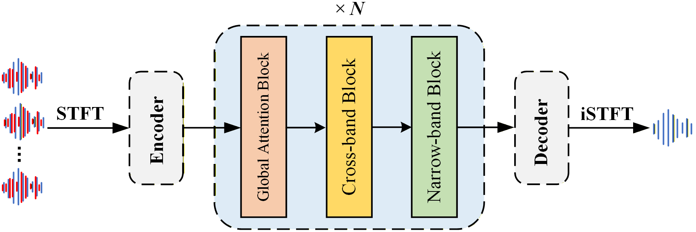

# MulSE: Integrating Dual-Path Modeling and Global Attention for Multi-Channel Speech Enhancement

This is the official implementation of **MulSE** submitted to IEEE Signal Processing Letter. We would release the code once the paper is accepted.
<p align="center">
  
</p>


## Highlights

- Transformer-free MCSE framework
- Global attention, cross-band, and narrow-band modeling
- Efficient dual-path spatio-spectral modeling
- Low computational complexity with competitive performance

---

## Installation

1. Create a virtual environment with Python and PyTorch.

We recommend:

- Python == 3.10
- PyTorch >= 2.0

2. Install dependencies:

```bash
pip install -r requirements.txt
